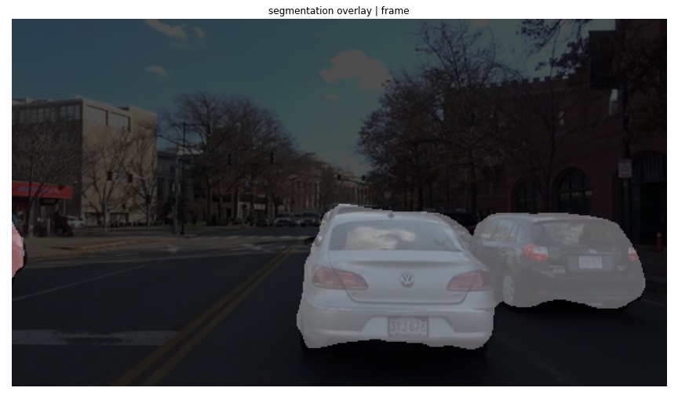

# Semantic-Segmentation
a tensorflow implementation for scene understanding and object detection using Semantic segmentation. This project uses the DeepLab model to perform semantic segmentation on a sample input image or video. Expected outputs are semantic labels overlayed on the sample image or each frame on the video frame set.

### About DeepLab
The models used in this project perform semantic segmentation. Semantic segmentation models focus on assigning semantic labels, such as sky, person, or car, to multiple objects and stuff in a single image.

### Build the model

    
**[DeepLab](https://github.com/tensorflow/models/tree/master/research/deeplab)** is a state-of-art deep learning model for semantic image segmentation, where the goal is to assign semantic labels (e.g., person, dog, cat and so on) to every pixel in the input image. Some segmentation results on Flickr images:

In the driving context, we aim to obtain a semantic understanding of the front driving scene throught the camera input. This is important for driving safety and an essential requirement for all levels of autonomous driving. The first step is to build the model and load the pre-trained weights. In this demo, we use the model checkpoint trained on [Cityscapes](https://www.cityscapes-dataset.com/) dataset.

|Road, Pedestrian, Bicycle, Traffic sign|Road, Car,Traffic Sign, Traffic Light |
|--|--|
|  |  |

## Semantic Segmentation
In semantic segmentation, By putting an image into a neural network, it generates an output a category for every pixel in the image. Now the output is a discrete set of categories, much like in a classification task. But instead of assigning a single class to an image, we want to assign a class to every pixel in that image. 

### Limitations of This Approach
* very expensive to label this data (labeling every pixel)
* computationally expensive to maintain spatial information in each convolutional layer

### Build the model
DeepLab is a state-of-art deep learning model for semantic image segmentation, where the goal is to assign semantic labels (e.g., person, dog, cat, car and so on) to every pixel in the input image.

### Segmentation Result(image)

### Segmentation Result(Video)

| 10s of driving|10sec detected result |
|--|--|
| | |

### Reference 
* [FCN paper]
* [Hierarchical Multi-Scale Attention for semantic segmentation](https://arxiv.org/abs/2005.10821)
