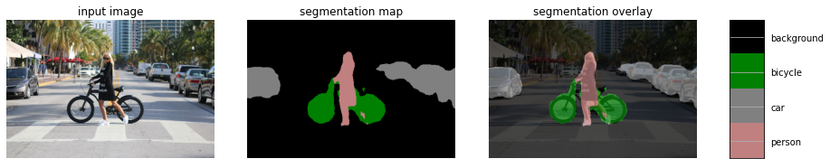

# Semantic-Segmentation
a tensorflow implementation for scene understanding and object detection using Semantic segmentation. This project uses the DeepLab model to perform semantic segmentation on a sample input image or video. Expected outputs are semantic labels overlayed on the sample image or each frame on the video frame set.The models used in this project perform semantic segmentation. Semantic segmentation models focus on assigning semantic labels, such as sky, person, or car, to multiple objects and stuff in a single image. 

### About DeepLab
**[DeepLab](https://github.com/tensorflow/models/tree/master/research/deeplab)** is a state-of-art deep learning model for semantic image segmentation, where the goal is to assign semantic labels (e.g., person, dog, cat and so on) to every pixel in the input image. In semantic segmentation, By putting an image into a neural network, it generates an output a category for every pixel in the image. Now the output is a discrete set of categories, much like in a classification task. But instead of assigning a single class to an image, we want to assign a class to every pixel in that image. 

In the driving context, we aim to obtain a semantic understanding of the front driving scene throught the camera input. This is important for driving safety and an essential requirement for all levels of autonomous driving. The first step is to build the model and load the pre-trained weights. In this demo, we use the model checkpoint trained on [Cityscapes](https://www.cityscapes-dataset.com/) dataset.

### Semantic Image Segementation Examples **CityScacpes**
Following segemented images are from [Cityscapes](https://www.cityscapes-dataset.com/) dataset result.
|Road, Pedestrian, Bicycle, Traffic sign|Road, Car,Traffic Sign, Traffic Light |
|--|--|
|  |  |


### Build the model - Steps
* Load the latest version of the pretrained DeepLab model
    * [MobileNetv2 Coco Train model](http://download.tensorflow.org/models/deeplabv3_mnv2_pascal_train_aug_2018_01_29.tar.gz)
    * [MobileNetv2 CoCo VocTrain Validation Model](http://download.tensorflow.org/models/deeplabv3_mnv2_pascal_trainval_2018_01_29.tar.gz)
    * [Xception CoCo VocTrain](http://download.tensorflow.org/models/deeplabv3_pascal_train_aug_2018_01_04.tar.gz)
    * [Xception CoCo VocTrain Validation](http://download.tensorflow.org/models/deeplabv3_pascal_trainval_2018_01_04.tar.gz)
* Load the colormap from the PASCAL VOC dataset
* Adds colors to various labels, such as "gray" for car, "pink" for people, "green" for bicycle and more as shown in the below result image
* Visualize an image, and add an overlay of colors on various regions

 Selected Segmented lables are as follows: 
```
LABEL_NAMES = np.asarray([
    'background', 'aeroplane', 'bicycle', 'bird', 'boat', 'bottle', 'bus',
    'car', 'cat', 'chair', 'cow', 'diningtable', 'dog', 'horse', 'motorbike',
    'person', 'pottedplant', 'sheep', 'sofa', 'train', 'tv'
])
```

### Limitations of This Approach
* very expensive to label this data (labeling every pixel)
* computationally expensive to maintain spatial information in each convolutional layer

### Segmentation Result(Overlayed Image)


Cars are detected and overlayed with "gray" colored segmented region.

### Segmentation Result(Overlayed Video)


| 10s of Driving|10sec Segmented Result |
|--|--|
| | |
|Original Driving HQ Video|Segmented HQ Video|
|[](https://www.youtube.com/watch?v=e1YBLrTz4os "SSD driving") |[](https://www.youtube.com/watch?v=ymMVubGbYHk "Semantic Image Segmentation result")|


Cars are detected and overlayed with "gray" colored segmented region. Pedestrians are detected and overlayed with "pink" colored segemented region. 

### Reference 
* [Semantic Image Segmentation with Deep Convolutional Nets and Fully Connected CRFs](https://arxiv.org/abs/1412.7062)
* [DeepLab: Semantic Image Segmentation](https://arxiv.org/abs/1606.00915)
* [DeepLab](https://github.com/tensorflow/models/tree/master/research/deeplab)
* [Hierarchical Multi-Scale Attention for semantic segmentation](https://arxiv.org/abs/2005.10821)
* [Cityscapes](https://www.cityscapes-dataset.com/) 

### Related Work
- [x] [YOLO Object Detection in tesnforflow](https://github.com/tooth2/YOLOv3-Object-Detection)
- [x] [YOLOv3 Object Detection in Pytorch](https://github.com/tooth2/YOLOv3-Pytorch)
- [x] [YOLOv3 Object Detection C++](https://github.com/tooth2/YOLOv3-Object-Detection)
- [x] [SSD(Single shot detection)](https://github.com/tooth2/SSD-Object-Detection)
- [x] [Semantic Segmentation for Scene Understanding](https://github.com/tooth2/Semantic-Segmentation)
